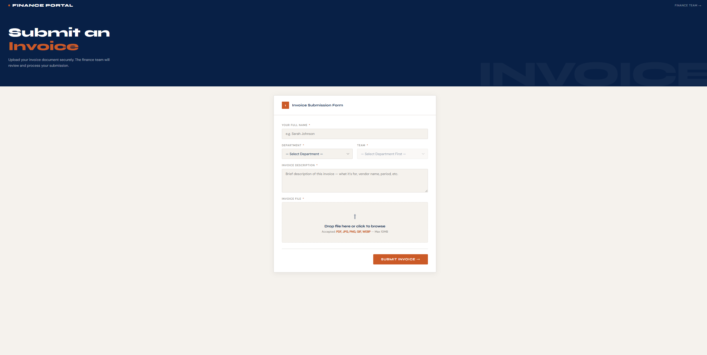
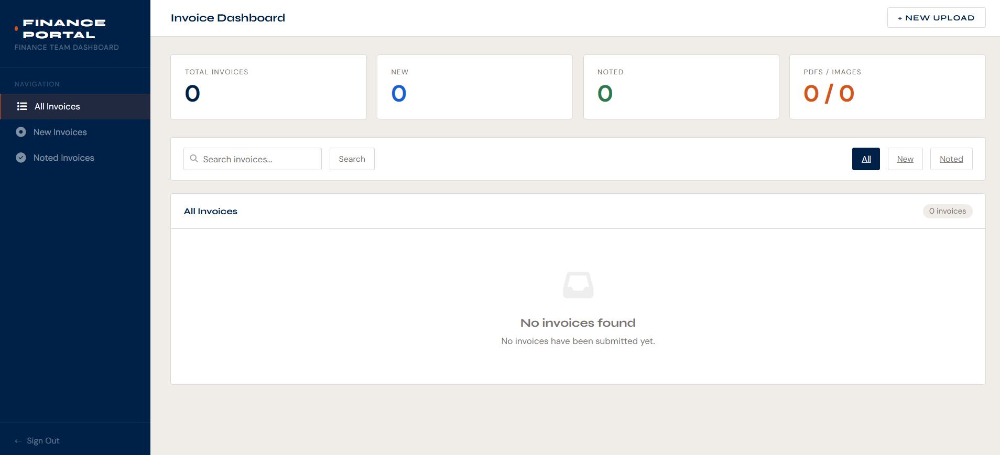

# 🧾 Invoice Sharing Portal

A lightweight **internal invoice submission and review system** built with **PHP and MySQL**.

Staff members upload invoices (PDF or images) tagged to their **department and team**, while the **finance team reviews and manages submissions from a clean dashboard** with **status tracking and file previews**.

Designed to run locally using **XAMPP** with **no external backend dependencies**, making it simple to deploy and maintain.

---

### Invoice Upload Page

### Finance Dashboard

---

## ✨ Features

### 👤 Staff / Uploader Side

- Select **department and team** using cascading dropdown menus  
- Enter **uploader name** and **invoice description**  
- **Drag & drop** or **click-to-browse** file upload  
- Supports file types:
  - PDF
  - JPG
  - PNG
  - GIF
  - WEBP
- Maximum upload size: **10MB**
- **Instant success confirmation** after submission

---

### 💼 Finance Team Dashboard

**Overview Stats**
- Total invoices
- New invoices
- Noted invoices
- PDFs vs Images

**Search**
- Search by uploader name
- Invoice description
- Department
- Team

**Filtering**
- All
- New
- Noted

**Table Features**
- Sortable columns
- Status indicator
- Date sorting

**Status Management**
- Toggle **New → Noted** per invoice
- **Bulk select**
- **Bulk status update**

**File Handling**
- Inline preview modal
- Supports **PDF and images**
- **One-click download**

**Notifications**
- Toast notifications for all actions

---

## 🛠 Tech Stack

| Layer | Technology |
|------|------------|
| Backend | PHP 7.4+ (MVC Pattern) |
| Database | MySQL / MariaDB |
| Frontend | Vanilla HTML, CSS, JavaScript |
| Icons | Font Awesome 6 |
| Fonts | Syne + DM Sans (Google Fonts) |
| Server | Apache via XAMPP |
